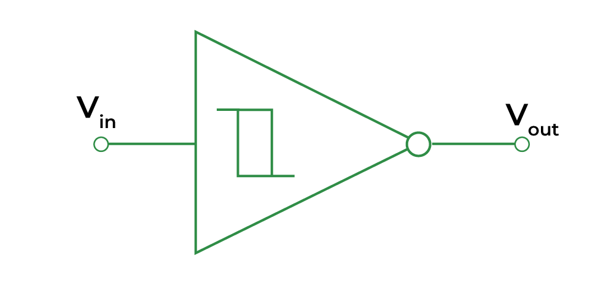
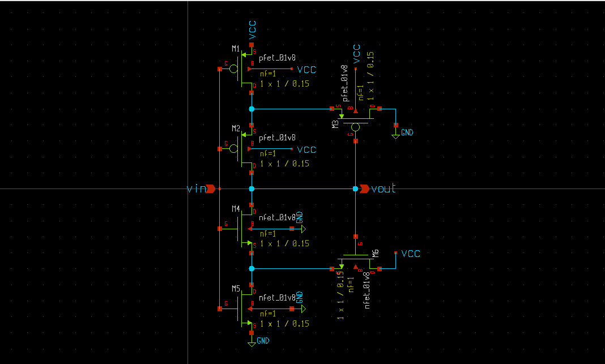
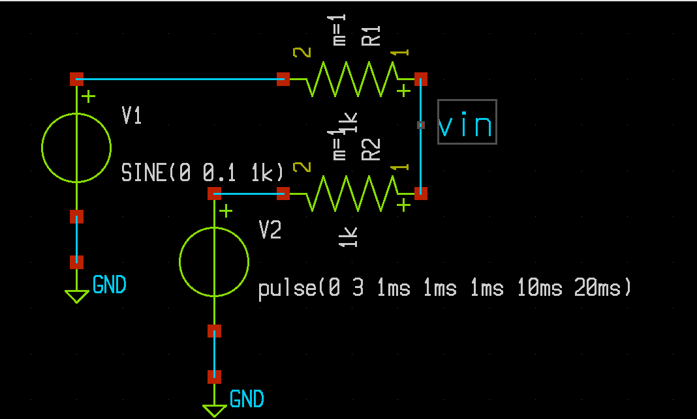
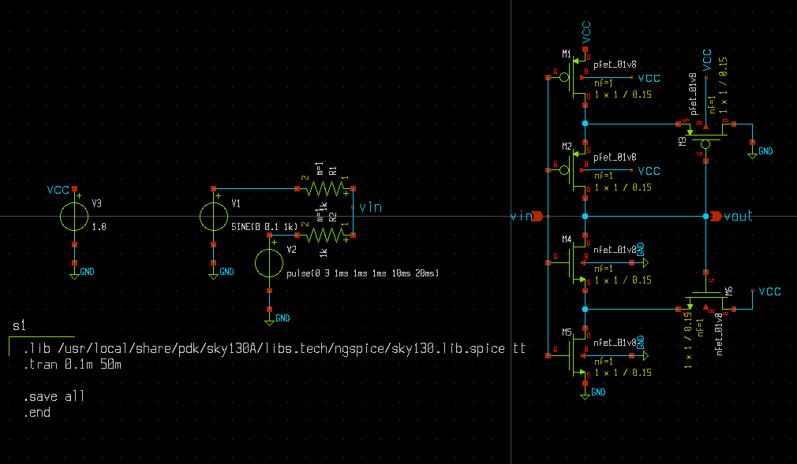
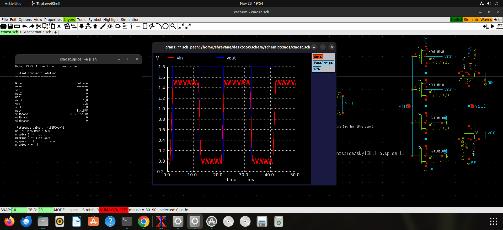
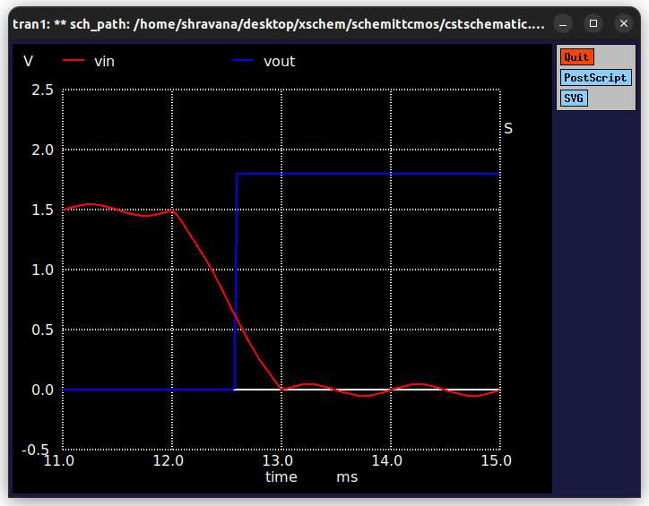
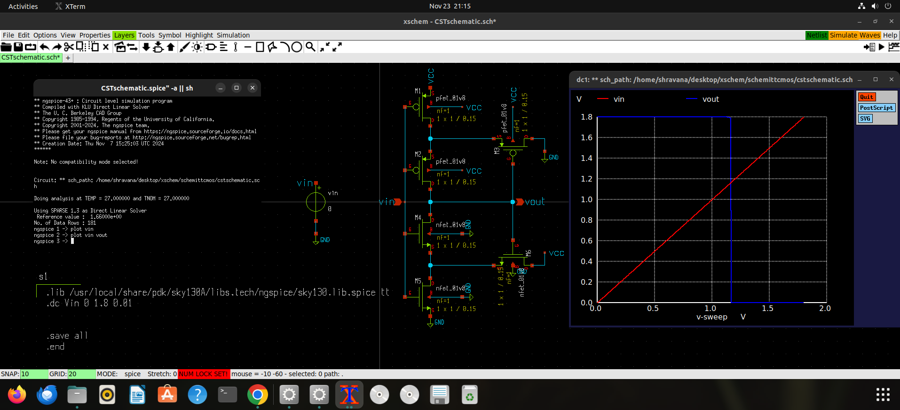

# CMOS-Based Schmitt Trigger

In this repository, I am designing and analyzing a **Schmitt Trigger** using the **SkyWater 130nm PDK Technology**.  
The design is created using [xschem](https://xschem.sourceforge.io/stefan/index.html) for schematic entry, and its parameters (plots) are obtained through pre-layout simulations using [ngspice](https://ngspice.sourceforge.io/).  
For the layout design, I am utilizing the [Magic VLSI Layout Tool](http://opencircuitdesign.com/magic/), a widely used open-source tool for IC design.

---

## Abstract

This repository focuses on the design, implementation, and analysis of a **CMOS-based Schmitt Trigger** using the SkyWater 130nm CMOS technology.  
A Schmitt Trigger is a bistable circuit that introduces **hysteresis** to input signals. It converts noisy or slowly varying analog inputs into clean digital outputs, ensuring reliable transitions. This behavior is achieved through two distinct threshold voltages: an **upper threshold (Vut)** and a **lower threshold (Vlt)**. The hysteresis mechanism significantly improves noise immunity, making Schmitt Triggers essential in modern digital systems.

---

## Functionality

The Schmitt Trigger operates by switching its output state based on two threshold voltages:  

1. **When the input voltage exceeds the upper threshold (Vut):** The output switches to LOW (logic 0).  
2. **When the input voltage drops below the lower threshold (Vlt):** The output switches to HIGH (logic 1).  
3. **When the input voltage lies between Vlt and Vut:** The output retains its previous state, ensuring stability against noise.  

This functionality enables the Schmitt Trigger to clean up noisy signals and provide stable transitions, making it ideal for applications like signal conditioning and waveform shaping.

---

## Truth Table

| Input Voltage Range         | Output State        | Description                                      |
|:----------------------------|:--------------------|:------------------------------------------------|
| Input > Upper Threshold (Vut) | LOW (logic 0)       | Output switches to LOW when input exceeds Vut.   |
| Input < Lower Threshold (Vlt) | HIGH (logic 1)      | Output switches to HIGH when input drops below Vlt. |
| Vlt ≤ Input ≤ Vut            | Retains Previous State | Output remains unchanged to prevent noise triggering. |

---

## Symbol of Schmitt Trigger

    
    
<strong>Symbol of Schmitt Trigger</strong>

---

## Circuit Diagram

A **Schmitt Trigger** can be implemented using a CMOS configuration with **3 PMOS transistors** and **3 NMOS transistors**, connected in a specific arrangement as shown in the circuit diagram.  

- **Power Supply:** +VDD is connected to the drains of the PMOS transistors, while the sources of the NMOS transistors are connected to GND.
- **Input:** The input signal is applied to the gates of the transistors.
- **Output:** The output is taken from the connection between the PMOS and NMOS transistors in the second stage.  

This configuration introduces positive feedback to create hysteresis, ensuring noise immunity and stable output transitions.

    
    
<strong>CMOS-Based Schmitt Trigger Circuit</strong>

---

## Input Signal Generation and Noise Injection

To analyze the functionality of the Schmitt Trigger, a **voltage divider network** is used to merge a square wave digital input signal with a high-frequency sine wave noise signal. This creates a distorted message signal (Vin), simulating real-world noise conditions for testing.  

    
    
<strong>Voltage Divider Network for Noise Signal</strong>

---

## Analysis of Schmitt Trigger

The distorted input signal (Vin) is applied to the gates of the CMOS transistors, and the output (Vout) is measured. The Schmitt Trigger effectively removes the noise, thanks to its hysteresis behavior, producing a clean digital output.  

    
    
<strong>Circuit Diagram for Analysis</strong>

---

## Working Principle

The Schmitt Trigger operates as follows:  

1. When the input voltage exceeds the **upper threshold (Vut):** The output switches to LOW (logic 0).  
2. When the input voltage drops below the **lower threshold (Vlt):** The output switches to HIGH (logic 1).  
3. When the input voltage lies between **Vut** and **Vlt:** The output retains its previous state, ensuring noise immunity and stable transitions.  

    
    
<strong>Input-Output Waveform of Schmitt Trigger</strong>

---

## **Delay Analysis of Schmitt Trigger**

Delay analysis is performed to determine the dynamic behavior of the Schmitt Trigger by measuring the time taken for the output to transition in response to changes in the input. The parameters calculated include the **Propagation Delays** (tpHL and tpLH), which represent the circuit's performance and speed in transitioning between logic states.

### **Procedure:**
- A time-varying input signal, such as a square wave, is applied to the circuit.
- The time delay is measured between the input signal's midpoint transition and the corresponding output signal's midpoint transition.

### **Key Parameters Calculated:**
- **tpLH (Propagation Delay - Low to High):** Time delay from the input falling to 50% (midpoint) to the output rising to 50%.  
  - Calculated Value: **224.37ps**
- **tpHL (Propagation Delay - High to Low):** Time delay from the input rising to 50% (midpoint) to the output falling to 50%.  
  - Calculated Value: **61.65ps**
- **Rise Time (tr):** Time taken for the output to rise from 10% to 90% of its maximum value.  
  - Calculated Value: **305.95ps**
- **Fall Time (tf):** Time taken for the output to fall from 90% to 10% of its maximum value.  
  - Calculated Value: **235.97ps**

### **Key Observations:**
- **tpLH > tpHL:** Indicates the circuit takes longer to transition from LOW to HIGH compared to HIGH to LOW, likely due to circuit design and asymmetry in pull-up and pull-down networks.
- **Rise and Fall Times:** These parameters highlight the sharpness of the output transitions, crucial for determining the circuit's effectiveness in high-speed operations.

### **Analysis Overview:**
Delay analysis highlights the circuit's speed and responsiveness under real-world conditions. These parameters are crucial for assessing the Schmitt Trigger's suitability for high-frequency applications, where minimizing delays is critical for reliable operation.

    
    
<strong>Circuit Diagram for Delay Analysis</strong>

---

## **DC Analysis of Schmitt Trigger**

DC analysis is performed to determine the static behavior of the Schmitt Trigger by varying the input voltage (Vin) across a range and observing the corresponding output voltage (Vout). This simulation provides the **Voltage Transfer Characteristics (VTC)** curve, which highlights the circuit's switching thresholds: the **Upper Threshold Voltage (Vht)** and **Lower Threshold Voltage (Vlt)**. These thresholds define the hysteresis window, enabling the circuit to reject noise and ensure stable transitions.

### **Calculated Values:**
- **Upper Threshold Voltage (Vht)** = **1.2V**  
- **Lower Threshold Voltage (Vlt)** = **0.6V**  
- **Threshold Voltage (Vth)** = **0.7V**  
- **Hysteresis** = **Vht - Vlt = 0.6V**  
- **Noise Margin** = **0.6V** (Determined using the difference between logic levels and threshold voltages)

### **Key Observations from the DC Sweep:**
- **Vth (Threshold Voltage)** defines the input voltage level at which the circuit switches from one state to another.
- **Vht (Upper Threshold Voltage)** marks the input voltage at which the output transitions from LOW to HIGH.
- **Vlt (Lower Threshold Voltage)** marks the input voltage at which the output transitions from HIGH to LOW.
- The **Hysteresis** between **Vht** and **Vlt** ensures noise immunity by preventing rapid switching caused by small fluctuations in the input signal.

### **Analysis Overview:**
The DC sweep simulation involves incrementally increasing the input voltage and measuring the output voltage. This provides a clear **Voltage Transfer Characteristic (VTC)** curve. The hysteresis is observed as the difference in input voltages at which the circuit transitions between HIGH and LOW states, ensuring stable operation even with noisy inputs.

    
    
<strong>Circuit Diagram for DC Analysis</strong>

---

## **Transfer Characteristics Analysis of Schmitt Trigger**

The transfer characteristics analysis of the Schmitt Trigger examines how the output voltage (Vout) responds to the input voltage (Vin) as it varies from 0 to the supply voltage (VDD). This analysis provides the **Voltage Transfer Characteristics (VTC)** curve, highlighting the circuit's hysteresis behavior.

### **Procedure:**
- A DC sweep is applied to the input voltage (Vin) across a range from 0 to VDD.
- The output voltage (Vout) is recorded for each input voltage value.
- The hysteresis window is analyzed by observing the switching points:
  - **Vht (Higher Threshold Voltage):** Input voltage at which the output switches from LOW to HIGH.
  - **Vlt (Lower Threshold Voltage):** Input voltage at which the output switches from HIGH to LOW.

### **Key Parameters Calculated:**
- **Vht (Higher Threshold Voltage):** 1.2V
- **Vlt (Lower Threshold Voltage):** 0.6V
- **Hysteresis (Vh):** Difference between Vht and Vlt.  
  - **Calculated Value:** 0.6V

### **Observations:**
- The hysteresis window (Vht - Vlt) demonstrates the Schmitt Trigger's ability to reject noise and stabilize output transitions.
- **Sharp Output Transitions:** The VTC curve shows distinct transition regions where the output switches states, ensuring reliable digital signal processing.

### **Applications:**
This analysis is crucial for circuits requiring noise immunity and clean transitions, such as clock signal generation and waveform shaping.

    
    
<strong>Circuit Diagram for Transfer Characteristics Analysis</strong>

---

## Voltage Transfer Characteristics (VTC)

The **Voltage Transfer Characteristics (VTC)** plot shows how the output changes as the input varies over its full swing. For a Schmitt Trigger, this curve demonstrates hysteresis due to the distinct **upper (Vut)** and **lower (Vlt)** thresholds.  
This hysteresis prevents false triggering caused by noise and ensures stable transitions between logic states.

---
## Parameters of the Schmitt Trigger

| Parameter                    | Description                                                                 | Value       | Unit | Technology    | Condition               |
|:----------------------------:|:---------------------------------------------------------------------------:|:-----------:|:----:|:-------------:|:-----------------------:|
| **Threshold Voltage (Vth)**   | The minimum input voltage required to switch the output state. This is the voltage at which the output begins to change. It sets the lower threshold of the input voltage range. | 0.6         | V    | SkyWater 130nm| -40°C to 125°C          |
| **Lower Threshold Voltage (Vlt)** | The minimum input voltage at which the output switches from HIGH to LOW. This defines the lower boundary of the hysteresis window. | 0.6        | V    | SkyWater 130nm| -40°C to 125°C          |
| **Upper Threshold Voltage (Vht)** | The input voltage at which the output switches from LOW to HIGH. This defines the upper boundary of the hysteresis window. | 1.2        | V    | SkyWater 130nm| -40°C to 125°C          |
| **Rise Time (tr)**            | The time taken for the output to rise from 10% to 90% of its final HIGH value. This is an important parameter for measuring the response speed of the circuit. | 305.95      | ps   | SkyWater 130nm| -40°C to 125°C          |
| **Fall Time (tf)**            | The time taken for the output to fall from 90% to 10% of its final HIGH value. This is another key measure of circuit response time. | 235.97      | ps   | SkyWater 130nm| -40°C to 125°C          |
| **Rise Time (tpl)**           | The time taken for the output to rise from 0% to 100% of its final HIGH value, typically used to describe the full rise characteristic. | 1         | ms   | SkyWater 130nm| -40°C to 125°C          |
| **Fall Time (tph)**           | The time taken for the output to fall from 0% to 100% of its final LOW value, typically used to describe the full fall characteristic. | 1         | ms   | SkyWater 130nm| -40°C to 125°C          |
| **Propagation Delay (tpHL)**  | The time delay from the input 50% rise to the output 50% fall, indicating the time it takes for the signal to transition from HIGH to LOW. | 61.65       | ps   | SkyWater 130nm| -40°C to 125°C          |
| **Propagation Delay (tpLH)**  | The time delay from the input 50% fall to the output 50% rise, indicating the time it takes for the signal to transition from LOW to HIGH. | 224.37      | ps   | SkyWater 130nm| -40°C to 125°C          |
| **Supply Voltage (Vcc)**      | The supply voltage that powers the Schmitt Trigger circuit. This voltage is used to define the operating range of the transistors. | 1.8         | V    | SkyWater 130nm| -40°C to 125°C          |
| **Output High Voltage (Voh)** | The maximum voltage level output during a logic HIGH state. This is the voltage level when the Schmitt Trigger is outputting a logical "1". | 5.0         | V    | SkyWater 130nm| -40°C to 125°C          |
| **Output Low Voltage (Vol)**  | The minimum voltage level output during a logic LOW state. This is the voltage level when the Schmitt Trigger is outputting a logical "0". | 0.0         | V    | SkyWater 130nm| -40°C to 125°C          |
| **Noise Margin**              | The difference between the logic levels (Voh and Vol) and the threshold voltages (Vlt and Vht) that defines the noise tolerance of the circuit. | 0.6         | V   | SkyWater 130nm| -40°C to 125°C          |
| **Hysteresis**                | The difference between the upper and lower threshold voltages (Vht - Vlt) that defines the noise rejection capacity of the circuit. | -           | V    | SkyWater 130nm| -40°C to 125°C          |
| **Power Consumption**         | The total power consumed by the Schmitt Trigger during operation. This can be measured during simulations under different operating conditions. | -           | W    | SkyWater 130nm| -40°C to 125°C          |

---

## Conclusion  

This CMOS-based Schmitt Trigger effectively demonstrates noise immunity and stable output transitions, making it a crucial component in digital systems. The design is scalable for various CMOS processes and provides an excellent foundation for understanding hysteresis and bistable circuits.  

